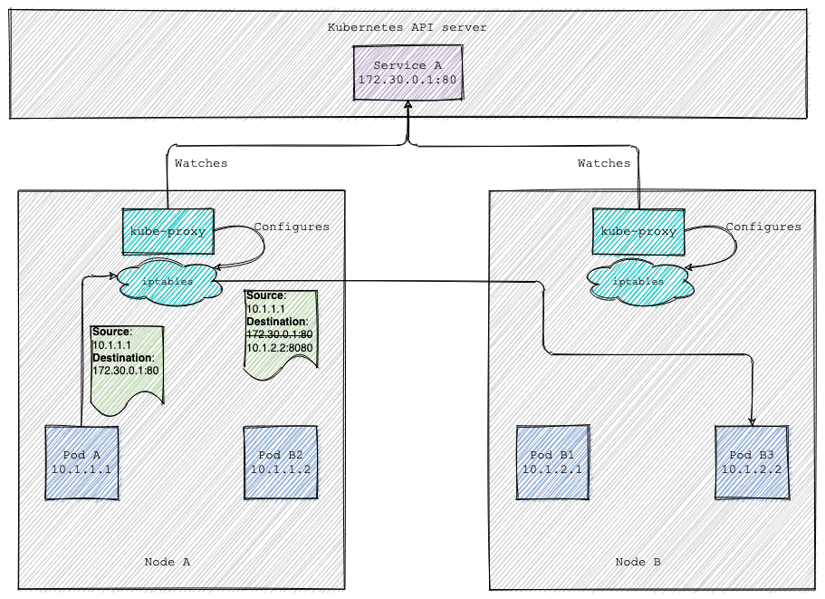

# Up and running with K8s

## Contents

- [Setting the scene](#setting-the-scene)

- [Lifecycle](#lifecycle)
  * [Set up](#set-up)
  * [Tear down](#tear-down)

- [The K8s resources](#the-k8s-resources)
  * [Getting information](#getting-information)
  * [Creating and deleting resources](#creating-and-deleting-resources)
  * [Debugging](#debugging)

- [Pods](#pods)
  * [Command and arguments](#command-and-arguments)

- [Labels and annotations](#labels-and-annotations)

- [Replica sets](#replica-sets)
  * [Pod acquisition](#pod-acquisition)
  * [Isolating pods](#isolating-pods)
  * [Autoscaling](#autoscaling)
  * [Final thoughs on replica sets](#final-thoughs-on-replica-sets)

- [Daemon sets](#daemon-sets)
  * [Pod and node selectors](#pod-and-node-selectors)
  * [Rolling update](#rolling-update)

- [Jobs](#jobs)
  * [Job patterns](#job-patterns)
  * [Completion](#completion)

- [Config Maps](#config-maps)
  * [Injecting configuration into pods](#injecting-configuration-into-pods)

- [Deployments](#deployments)
  * [Replica set selectors](#replica-set-selectors)
  * [Upgrades](#upgrades)
  * [Rollout information](#rollout-information)
  * [Rollbacks](#rollbacks)
  * [Strategies](#strategies)

- [Services](#services)
  * [The Domain Name System (DNS)](#the-domain-name-system-dns)
  * [Endpoints](#endpoints)
  * [Type of services](#type-of-services)

- [Kubernetes internals](#kubernetes-internals)
  * [Service Proxy](#service-proxy)

## Setting the scene

Kubernetes is an open source orchestrator for deploying containerized applications. It provides the
software necessary to successfully build and deploy reliable, scalable distributed systems.

Kubernetes strongly believes in *declarative configuration*; everything in Kubernetes is a
declarative configuration object that represents the desired state of the system. The key idea is
having configuration files or manifests describing the desired state of the world. Those manifests
are submitted to a service that ensures this desired state becomes the actual state.

Declarative configuration is an alternative to imperative configuration, where the state of the
world is defined by the execution of a series of instructions rather than a declaration of the
desired state of the world. While imperative commands define actions, declarative configurations
define state. It is the difference between **doing** and **describing**.

With declarative state rollbacks become trivially easy; it is simply restating the previous
declarative state of the system. With imperative systems this is usually impossible, since while the
imperative instructions describe how to get you from point A to point B, they rarely include the
reverse instructions that can get you back.

## Lifecycle

### Set up
In this example we will setup a minikube single-node cluster.
```bash
$ minikube start --namespace='default' --mount=true --mount-string="$PWD/minikube-data:/minikube-host" --memory=6g
$ minikube dashboard
```

Your cluster should be up and running. A cluster is a collection of cooperating nodes In Kubernetes,
nodes are seperated into:
1. Master nodes that contain containers like the API server, scheduler, etc., which manage the cluster.
1. Worker nodes where your containers will run.

Kubernetes won’t generally schedule work onto master nodes to ensure that user workloads don’t harm
the overall operation of the cluster. Because we are running Kubernetes locally, we have an one-node
cluster.
```bash
$ kubectl get nodes
NAME       STATUS   ROLES                  AGE   VERSION
minikube   Ready    control-plane,master   24h   v1.20.2
$ kubectl describe nodes minikube
```

In production environments multi-node Kubernetes clusters are installed.
```bash
$ kubectl get nodes
NAME                            STATUS   ROLES                                  AGE   VERSION
ip-172-16-80-146.ec2.internal   Ready    kafka-connect-nodes,node,spot-worker   42h   v1.18.10
ip-172-16-80-252.ec2.internal   Ready    master                                 23d   v1.18.10
ip-172-16-81-23.ec2.internal    Ready    node                                   23d   v1.18.10
ip-172-16-81-84.ec2.internal    Ready    kafka-connect-nodes,node,spot-worker   34h   v1.18.10
ip-172-16-82-14.ec2.internal    Ready    kafka-connect-nodes,node,spot-worker   23d   v1.18.10
ip-172-16-82-198.ec2.internal   Ready    node                                   23d   v1.18.10
ip-172-16-82-223.ec2.internal   Ready    node                                   23d   v1.18.10
ip-172-16-82-35.ec2.internal    Ready    kafka-connect-nodes,node,spot-worker   23d   v1.18.10
ip-172-16-83-220.ec2.internal   Ready    master                                 23d   v1.18.10
ip-172-16-84-17.ec2.internal    Ready    kafka-connect-nodes,node,spot-worker   42h   v1.18.10
ip-172-16-84-199.ec2.internal   Ready    node                                   23d   v1.18.10
ip-172-16-84-201.ec2.internal   Ready    node                                   23d   v1.18.10
ip-172-16-85-10.ec2.internal    Ready    master                                 23d   v1.18.10
```

### Tear down
We can check the status and delete a cluster:
```bash
$ minikube status
$ minikube delete
```

## The K8s resources
Everything contained in Kubernetes is represented by a *RESTful resource* or *Kubernetes object*.
Each Kubernetes object exists at a unique HTTP path, for example https://your-k8s.com/api/v1/namespaces/default/pods/my-pod
leads to the representation of a pod in the     default namespace named my-pod. The **kubectl command**
makes HTTP requests to these URLs to access the Kubernetes objects that reside at these paths.
```bash
$ kubectl cluster-info
Kubernetes master is running at https://127.0.0.1:53953
KubeDNS is running at https://127.0.0.1:53953/api/v1/namespaces/kube-system/services/kube-dns:dns/proxy
```

### Getting information
The most basic command for viewing Kubernetes objects via **kubectl** is **get**. It gets a listing
of all resources in the current namespace (e.g. all pods, deployments, configMaps, etc.).
```bash
$ kubectl get <resource-name>
$ kubectl get <resource-name> <object-name>
```
By default, **kubectl** uses a human-readable printer for viewing the responses from the API server,
but this human-readable printer removes many of the details of the objects to fit each object on one
terminal line. One way to get slightly more information is to add the `-o wide` flag, which gives
more details, on a longer line. If you want to view the complete object, you can also view the
objects as raw JSON or YAML using the `-o json` or `-o yaml` flags, respectively.

If you are interested in more detailed information about a particular object, use the **describe**
command:
```bash
$ kubectl describe <resource-name> <object-name>
```

### Creating and deleting resources
Objects in the Kubernetes API are represented as *JSON* or *YAML* files. Let’s assume that you have
a simple object stored in `obj.yaml`. You can use **kubectl** to create this object in Kubernetes by
running:
```bash
$ kubectl apply -f obj.yaml
```
Notice that you don’t need to specify the resource type of the object; it’s obtained from the object
file itself. Similarly, after you make changes to the object, you can use the apply command again to
update the object.

When you want to delete an object, you can simply run:
```bash
$ kubectl delete -f obj.yaml
$ kubectl delete <resource-name> <object-name>
```

### Debugging
You can see the logs of a resource using the **log** command. In case multiple containers are
running to a single pod you can specify the container of interest.
```bash
$ kubectl log <log-name> -c container-name
```

You can also use the **exec** command to execute a command in a running container:
```bash
$ kubectl exec -it <pod-name> -- /bin/bash
```
This will provide you with an interactive shell inside the running container so that you can perform
more debugging.

## Pods
Many times containerized applications need to colocate into a single atomic unit, scheduled onto a
single machine. Such containerized applications need to work together symbiotically, forming a
single cohesive unit of service; for example, one container serving data stored in a shared volume
to the public, while a separate sidecar container refreshes or updates those files.

A pod represents a collection of application containers and volumes running in the same execution
environment. Pods, not containers, are the smallest deployable unit in a Kubernetes cluster. This
implies that all of the containers in a pod always land on the same machine. It might seem tempting
to wrap up all containers into a single *"uber container"* and deploy the latter instead. However,
there are good reasons for keeping the containers separate. First, the containers might have
significantly **different requirements** in terms of resource usage (e.g. memory, cpu). Secondly, we
want to ensure **resource isolation**; a problem in one container (e.g. a memory leak) cannot affect
other containers running in the same pod.

Applications running in the same pod share the same IP address and port space (network namespace),
have the same hostname (UTS namespace), and can communicate using native interprocess communication
channels.

Pods are described by pod manifests; a text-file representation of the Kubernetes object. The
manifests are generally written in `YAML` format, but `JSON` is also supported.
```bash
$ kubectl apply -f postgres/database.yaml
$ kubectl delete pods <pod-name>
```

When you run your application as a container in Kubernetes, it is automatically kept alive for you
using a process health check. This health check simply ensures that the main process of your
application is always running. If it is not, Kubernetes is responsible to restart it so to keep the
state of the world consistent. However, in many cases, a simple process check is insufficient. For
example, if your process has deadlocked and is unable to serve requests, a process health check will
still believe that your application is healthy since its process is still running. Kubernetes
introduced health checks for application liveness. Liveness health checks run application-specific
logic and need to be described in the pod manifest. Liveness probes are defined per container, which
means each container inside a pod is health-checked separately.

In addition to `httpGet` checks, Kubernetes also supports `tcpSocket` health checks that open a TCP
socket; if the connection is successful, the probe succeeds. This style of probe is useful for
non-HTTP applications; for example, databases or other non–HTTP-based APIs.

```yaml
# Custom pod HTTP health-check definition.
livenessProbe:
  httpGet:
    path: /healthy
    port: 8080
  initialDelaySeconds: 5
  timeoutSeconds: 1
  periodSeconds: 10
  failureThreshold: 3
```

With Kubernetes a pod can specify two different resource (typically memory and CPU) metrics:
- Resource **requests** specify the minimum amount of a resource required to run the application. Kubernetes guarantees that these resources are available to the pod.
- Resource **limits** specify the maximum amount of a resource that an application can consume.

```yaml
resources:
  requests:
    cpu: "500m"
    memory: "128Mi"
```

An important part of an application is access to persistent disk. The volumes that may be accessed
by containers in a pod are defined in `spec.volumes` section. Then, each container needs to define
the volumes it wants to mount and the respective path that the volumes are mounted. Note that two
different containers in a pod can mount the same volume at different mount paths. Using shared
volumes enables containers running in the same pod to share data between them.

Other applications do not actually need a persistent volume, but they do need some access to the
underlying host filesystem. For example, they may need access to the `/dev` filesystem in order to
perform raw block-level access to a device on the system. For these cases, Kubernetes supports the
`hostPath` volume, which can mount arbitrary locations on the worker node into the container.

```yaml
apiVersion: v1
kind: Pod
metadata:
  # It must be a valid a valid DNS subdomain name as defined in [RFC-1123](https://tools.ietf.org/html/rfc1123)
  name: mount-volume-example
spec:
  containers:
  - image: k8s.gcr.io/test-webserver
    name: test-container
    volumeMounts:
    - mountPath: /mount/path
      name: host-volume
  volumes:
  - name: host-volume
    hostPath:
      # directory location on host
      path: /data
      # this field is optional
      type: Directory
```

### Command and arguments
When you create a pod, you can define a command and arguments for each container that run in the
pod. To define a command, include the `spec.containers[].command` field in the configuration file.
To define arguments for the command, include the `spec.containers[].args` field in the configuration
file. The command and arguments that you define in the configuration file override the default
command and arguments provided by the container image. If you define args, but do not define a
command, the default command is used with your new arguments.

When using docker runtime:
  - The `command` corresponds to dockerfile's `ENTRYPOINT`.
  - The `args` corresponds to dockerfile's `CMD`.

## Labels and annotations
Labels are key-value pairs that are attached to Kubernetes objects, such as pods or replica sets.
Labels provide identifying metadata for Kubernetes objects. They provide the foundation for
searching, grouping and viewing objects. Annotations on the other hand are key-value pairs designed
to hold non-identifying information that can be leveraged by tools and libraries. While labels are
used to identify and group objects, annotations are used to provide extra information about where
an object came from, how to use it, or policy around that object.

Labels are key-value pairs where both the key and value are represented by strings. Keys can be
broken down into two parts: an optional prefix and a name, separated by a slash. The prefix, if
specified, must be a valid DNS subdomain as defined in [RFC-1123](https://tools.ietf.org/html/rfc1123)
with a 253-character limit. The key name is required and must be shorter than 63 characters. Values
are strings with a maximum length of 63 characters.

```bash
$ kubectl get <resource-name> --show-labels
$ kubectl get pods -l app=database,env=development
$ kubectl get pods -l 'app in (database, server)'
```

One common use case of labels is for pods to specify node selection criteria. For example, the
sample pod below selects nodes with the label _"accelerator=nvidia-tesla-p100"_:
```yaml
apiVersion: v1
kind: Pod
metadata:
  name: pod-name
spec:
  containers:
    ...
  nodeSelector:
    accelerator: nvidia-tesla-p100
```

## Replica sets
More often than not, you want multiple replicas of an application running at a particular time. The
purpose of a ReplicaSet Kubernetes object is to maintain a stable set of replica pods running at any
given time. Of course, you could manually create multiple copies of a pod using multiple different
(though largely similar) pod manifests, but doing so is both tedious and error-prone. With replica
sets you can manage a replicated set of pods as a single entity. Pods managed by replica sets are
automatically rescheduled under certain failure conditions such as node failures and network
partitions.

### Pod acquisition
One of the key themes that runs through Kubernetes is decoupling. In this spirit, the relationship
between replica sets and pods is loosely coupled. Though replica sets create and manage pods, they
do not own the pods they create. Replica sets use labels to identify the set of pods they should be
managing. This implies that __a replica set can adopt existing pods__. A replica set is linked to
its pods via the pod's `metadata.ownerReferences` field, which specifies what resource the current
object is owned by. If there is a pod that matches selector labels of the replica set and does not
have any owner, then it will be will be immediately acquired by the replica set.

A replica set manifest needs to define a pod template specifying the kind of new pods it should
create to meet the number of replicas criteria. The pod template is only used at pod creation time.
Existing pods acquired by the replica set (based on the pod seletion criteria) migth have totally
different templates. It also implies that changing the pod template will not affect already existing
pods.

### Isolating pods
Oftentimes, when a server misbehaves, it is desirable to attach to the pod and interactively debug
it. In case the pod's health checks are incomplete, a pod can be misbehaving but still be part of
the replicated set. In such cases, instead of killing the pod, one can modify the labels of the sick
pod. Doing so, will disassociate it from the replica set. The controller of the replica set will
spawn a new copy, but because the sick pod is still running it is available for interactive
debugging.

### Autoscaling
While there will be times when you want to have explicit control over the number of replicas, often
you simply want to have “enough” replicas. You might want to scale based on memory consumption, CPU
usage, or in response to any custom application metric.

Kubernetes can handle autoscaling via an object called **HorizontalPodAutoscaler**. While the name
is kind of mouthful, Kubernetes makes a distinction between horizontal (adding more replicas of a
pod) and vertical scaling (increasing the resources available to a pod).

```yaml
apiVersion: autoscaling/v1
kind: HorizontalPodAutoscaler
metadata:
  name: ngnix-scaler
spec:
  scaleTargetRef:
    kind: ReplicaSet
    name: nginx-server-replicaset
  minReplicas: 2
  maxReplicas: 10
  targetCPUUtilizationPercentage: 50
```

### Final thoughs on replica sets
Typically, pods part of a replica set are fronted by a Kubernetes service load balancer, which
spreads traffic across the pods that make up the service. Generally speaking, replica sets are
designed for stateles (or nearly stateless) services. When a replica set is scaled down, an
arbitrary pod is selected for deletion. Using the `controller.kubernetes.io/pod-deletion-cost`
annotation, users can set a preference regarding which pods to remove first when downscaling a
replica set.

## Daemon sets
Replica sets are generally about creating a service (e.g., a web server) with multiple replicas for
redundancy. But that is not the only reason you may want to replicate a set of pods within a
cluster. Another reason to replicate a set of pods is to schedule a single pod on every node within
the cluster. Generally, the motivation for replicating a pod to every node is to land some sort of
agent or daemon on each node. Daemon sets are used to deploy system daemons such as *log collectors*
and *monitoring agents*, which typically must run on every node.

### Pod and node selectors
The `spec.selector` field is a pod selector, specifying the pods that are part of the daemon set. If
a pod matching the labels of the pod selector already exists in the node (and is not owned by anyone
else), it will be acquired by the daemon set. If you specify a `spec.template.spec.nodeSelector`,
then the daemon set controller will create pods on nodes which match that node selector.

### Rolling update
DaemonSet has two update strategy types:
- `OnDelete`: After you update a daemon set manifest, new pods will only be created when you manually delete old DaemonSet pods.
- `RollingUpdate`: After you update a daemon set manifest, old pods will be killed, and new pods will be created automatically, in a controlled fashion.

An alternative, is to just delete the entire daemon set and create a new daemon set with the updated
configuration. However, this approach has a major drawback: **downtime**. When a daemon set is
deleted all pods managed by that daemon set will also be deleted. Depending on the size of your
container images, recreating a daemon set may push you outside of your SLA thresholds.

## Jobs
So far we have focused on long-running workloads such as databases and web applications. While
long-running processes make up the large majority of workloads, there is often a need to run
*short-lived*, *one-off* tasks. A job creates one or more pods and will continue to retry execution
of the pods until a specified number of them successfully terminate (i.e., exit with 0). When a
specified number of successful completions is reached, the job is complete. Deleting a Job will
clean up the Pods it created. In contrast, a regular pod will continually restart regardless of its
exit code.

The `spec.selector` field is optional. In almost all cases you should not specify it. The system
defaulting logic adds this field when the job is created. It picks a selector value that will not
overlap with any other jobs. Like with other controllers (daemon sets, replica sets, deployments,
etc.) that use labels to identify a set of pods, unexpected behaviors can happen if a pod is reused
across objects.

### Job patterns
There are three main types of task suitable to run as a job:
  1. `One-shot`: only one pod is started, unless the pod fails. This is suitable for tasks like database migrations.
  2. `Parallel jobs with fixed completion count`: multiple pods processing a fixed set of work in parallel.
  3. `Parallel Jobs pulling tasks from a work queue:`: multiple pods processing from a centralized work queue. This requires running a queue service, and modifications to the existing application to make it use the work queue.

### Completion
It is possible to specify a `spec.completionMode: Indexed`, in case we want to differentiate between
pods of the same job. Each pod gets an associated completion index from `0` to `spec.completions - 1`,
which is available in the annotation `batch.kubernetes.io/job-completion-index`. The value of the
index is exposed in the `JOB_COMPLETION_INDEX` environment variable. The job is considered complete
when there is one successfully completed pod for each index.

After the job has completed, the job object and related pods are still available. This is so that
you can inspect the log output. The job object also remains after it is completed so that you can
view its status. It is up to the user to delete old jobs.
```bash
$ kubectl delete jobs <job-name>
```

## Config Maps
Config maps are used to provide non-confidential configuration information for Kubernetes workloads
in the form of key value pairs. This can either be fine-grained information (a short string) or a
composite value in the form of a file. Pods can consume config maps as environment variables,
command line arguments, or as configuration files in a volume.

A config map is a Kubernetes object that lets you store configuration for other objects to use.
Unlike most Kubernetes objects that have a spec, a config map has `data` and `binaryData` fields.
These fields accept key-value pairs as their values. The `data` field is designed to contain UTF-8
byte sequences while the `binaryData `field is designed to contain binary data as base64-encoded
strings.

### Injecting configuration into pods
There are four different ways that you can use a config map to configure a container inside a pod:
  1. `Command-line arguments`: in the `command` and `args` fields of a container.
  1. `Environment variable`: sets the value of environmental variables of a container.
  1. `Filesystem`: mounts a config map in a read only volume as a file.
  1. `Kubernetes API`: application code that reads directly from the API.

For the first three methods, the Kubernetes uses the data from the config map *when it launches container(s)* 
for a pod. The fourth method means you have to write code to read the config map and its data.
```yaml
apiVersion: v1
kind: ConfigMap
metadata:
  name: config-example
data:
  username: "username"
  password: "password"
  file.config: |
    config.first=one
    config.two=two
```

In the pod definition we can include the aforementioned parameters.
```yaml
apiVersion: v1
kind: Pod
spec:
  volumes:
    # Set volumes at the pod level, then mount them into containers inside that pod
    - name: config-volume
      configMap:
        # Provide the name of the ConfigMap you want to mount.
        name: config-example
        # An array of keys from the ConfigMap to create as files
        # If you not specify anything here, every key under data will be mounted.
        items:
        - key: file.config
          path: file.config
  
  containers:
    - name: some-name
    image: ubuntu:20.04
    command: ["/bin/bash", "-c"]
    args: ["echo $(ENV_VAR_PASSWORD) && while true; do sleep 30; done;"]
    env:
      # Define the environment variables
      - name: ENV_VAR_PASSWORD # Notice that the case is different here from the key name in the ConfigMap.
        valueFrom:
          configMapKeyRef:
            name: config-example # The ConfigMap this value comes from.
            key: password        # The key to fetch.
      - name: ENV_VAR_USERNAME
        valueFrom:
          configMapKeyRef:
            name: config-example # The ConfigMap this value comes from.
            key: username        # The key to fetch.
    volumeMounts:
      # The name must match the name of a pod volume.
      - name: config-volume
        mountPath: "/config"
        readOnly: true
```

When a config map currently consumed in a volume is updated, projected keys are eventually updated
as well. A config map can be either propagated by watch (default), ttl-based, or by redirecting all
requests directly to the API server. As a result, the total delay from the moment when the config
map is updated to the moment when new keys are projected to the pod can be as long as the sync
period + cache propagation delay, where the cache propagation delay depends on the chosen cache type
(it equals to watch propagation delay, ttl of cache, or zero correspondingly).

## Deployments
Deployment objects help manage the release of new versions of your application. With a deployment
object you can simply and reliably rollout new software versions without downtime or errors.

### Replica set selectors
Deployments manage replica sets, the same way replica sets manage pods. A deployment can adopt an
already existing replica set if it matches the `spec.selector` field. At a first glance, the
specification for a deployment looks very much like the one for a replica set. Deployments, however,
don’t create or delete pods directly. They delegate that work to one ore more replica sets. When we
create a deployment, it creates a replica set, using the exact pod specification that we gave it.

The `pod-template-hash` label is added to every replica set that a deployment creates or adopts.
This label ensures that child replica sets of a deployment do not overlap. It is generated by
hashing the pod manifest of the replica set and using the resulting hash as the label
value that is added to the replica set selector, pod template labels, and in any existing pods that
the replica set might have.

### Upgrades
Things get interesting when we need to update the pod specification itself. This is a common use
case due to bug fixes, change in business requirements and so on. For instance, we might want to
change the image to use (because we are releasing a new version), or the application’s parameters
(through command-line arguments, environment variables, or configuration files).

A deployment rollout is triggered if and only if the deployment's pod template (that is,
`spec.template`) is changed. For example if the labels or container images of the template are
updated. Other updates, such as scaling the deployment, do not trigger a rollout.

You can add the `--record` flag when applying a deployment to keep track of the commands executed.
The recorded change is useful for future introspection (e.g. when we want to rollback). The `CHANGE-CAUSE`
is copied from the deployment annotation `kubernetes.io/change-cause`.

When a rollout is triggered, the deployment creates a new replica set with the updated pod
specification. That replica set has an initial size of zero. Then, the size of that replica set is
progressively increased, while decreasing the size of the old replica set.

Assume we have deployed a replica set with the following specification:
```yaml
apiVersion: apps/v1
kind: ReplicaSet
metadata:
  labels:
    app: some-app
spec:
  replicas: 2
```

Now if we create a deployment that selects on the labels of the replica set, then the deployment
will acquire the existing replica set. Depending on whether the pod specification is the same or
different a rollout will occur.
```yaml
apiVersion: apps/v1
kind: Deployment
spec:
  replicas: 2
  selector:
    matchLabels:
      app: some-app
```

### Rollout information
During an upgrade you can inspect the status of the rollout using the `rollout status` command.
```bash
$ kubectl rollout status deployments <deployment-name>
Waiting for deployment "<deployment-name>" rollout to finish: 1 out of 3 new replicas have been updated...
Waiting for deployment "<deployment-name>" rollout to finish: 1 out of 3 new replicas have been updated...
Waiting for deployment "<deployment-name>" rollout to finish: 1 out of 3 new replicas have been updated...
Waiting for deployment "<deployment-name>" rollout to finish: 2 out of 3 new replicas have been updated...
Waiting for deployment "<deployment-name>" rollout to finish: 2 out of 3 new replicas have been updated...
Waiting for deployment "<deployment-name>" rollout to finish: 2 out of 3 new replicas have been updated...
Waiting for deployment "<deployment-name>" rollout to finish: 1 old replicas are pending termination...
Waiting for deployment "<deployment-name>" rollout to finish: 1 old replicas are pending termination...
deployment "<deployment-name>" successfully rolled out
```

### Rollbacks
Sometimes, you may want to rollback a deployment; for example, when the deployment is not stable. By
default, all of the deployment's rollout history is kept in the system so that you can rollback
anytime you want.

You can check the rollout history using `rollout history` command. You can inspect a specific
revision by using `--revision` flag.
```bash
$ kubectl rollout history deployments <deployment-name> --revision=<revision-num>
```

You can select the revision you want to rollback and apply the change.
```bash
$ kubectl rollout undo deployments <deployment-name> --to-revision=<revision-num>
```

### Strategies
There are two different strategies for rolling out an update:
  - `spec.strategy.type: RollingUpdate`, updates pods in a rolling update fashion.
  - `spec.strategy.type: Recreate`, all existing pods are killed before spawning new ones.

Rolling update strategy ensures that only a certain number of pods are down while they are being
updated. The `spec.strategy.rollingUpdate.maxUnavailable` field specifies the maximum number of pods
that can be unavailable during the update process. The value can be an absolute number (for example,
5) or a percentage of desired pods (for example, 10%). For example, when this value is set to 30%,
the old replica set can be scaled down to 70% of desired pods immediately when the rolling update
starts. Once new pods are ready, old replica set can be scaled down further. On the other side of
the spectrum, the `spec.strategy.rollingUpdate.maxSurge` field specifies the maximum number of pods
that can be created over the desired number of pods. The value can be an absolute number (for
example, 5) or a percentage of desired pods (for example, 10%). For example, when this value is set
to 30%, the new replica set can be scaled up immediately when the rolling update starts, such that
the total number of old and new Pods does not exceed 130% of desired pods.

## Services
Pods are indented to be **ephemeral**. Each pod gets its own IP address, however in a replica set or
deployment, the set of pods running in one moment in time could be different from the set of pods
running the same application a moment later. The ephemeral nature of pods leads to a significant
problem *how do the applications find out and keep track of which IP address to connect to*.

In Kubernetes, all pods can reach each other pod on their internal IP addresses, no matter on which
nodes they are running. You can get the internal IP address of any running pod using `kubectl get pods -o wide`.

A Kubernetes service is an object which defines a logical set of pods and a policy by which to
access them. Services expose a single, constant point of entry to a group of pods providing the same functionality. The set of pods targeted by a service is usually determined by a **selector**. The following manifest describes a new service object named *"service-name"*, which targets TCP port
9376 on any pod with the `app=some-app` label. **Services point to pods** using labels. Services do
not point to deployments or replica sets.
```yaml
apiVersion: v1
kind: service
metadata:
  name: service-name
spec:
  type: ClusterIP
  selector:
    app: some-app
  ports:
    - protocol: TCP
      # The exposed port
      port: 80
      # The target port in the pod
      targetPort: 9376
```

Each service has an IP address and port that never change while the service exists. Clients can open connections to that IP and port, and those connections are then routed / forwarded to one of the pods backing that service. This way Kubernetes achieves **load-balancing** across all the backing pods. The IP address associatted to a service is usually referred to as cluster IP, because it’s only accessible from inside the Kubernetes cluster.

### The Domain Name System (DNS)

By creating a service, you now have a single and stable IP address that you can hit to access your pods. This address will remain unchanged throughout the whole lifetime of the service. Pods behind this service may come and go, but they will always be accessible through the service’s single and constant IP address. But how do the clients know the IP and port of a service ? Each service gets a DNS entry in the Kubernetes internal name server, and client pods only need to know the name of the service.

#### Introduction
DNS is a naming system for resolving human-readable domain names to their associated IP addresses.
DNS is a **hierarchically organized distribued server-based system** that acts as the phone book of
the internet. People do not have to remember meaningless IP address numbers and can look up websites
using human-friendly names instead. More information about the DNS specification can be found at
[RFC-1034](https://tools.ietf.org/html/rfc1034) and [RFC-1035](https://tools.ietf.org/html/rfc1035).

At the end of a typical web URL you have a single slash `/` character. This character signals the
end of the domain name. URLs are used to identify resources on the internet and usually contain
more information than the domain name (e.g. protocol, path to the resource, etc.). The domain name
is the part of the URL that will be eventually replaced by an IP address.
```
URL ☞ https://calendar.google.com/calendar/user85312
      ╰—————╯ ╰—————————————————╯ ╰————————————————╯
         |            |                   |
         |            |                   |
         |            |                   └─⫸ The path to the resource.
         |            |    
         |            └─⫸  The dommain name.
         |
         └─⫸ The protocol.
```

Every website address has an implied “.” at the end (just before the slash character), even if we
do not type it in. For example, `mail.google.com` is translated to `mail.google.com.`. As we will
shortly discuss, this “.” refers to the root domain or "zone".

Domain names are organized in subordinate levels (subdomains) of the DNS root domain. In general, a subdomain is a domain that is part of a larger domain. As an example, consider the domain `mail.google.com.`:
  * `.com` is a subdomain of the root `.` domain.
  * `.google` is a subdomain of the `.com.` domain.
  * `mail` is a subdomain of the `.google.com.` domain.

In most cases the last to the left name is also referred to as [hostname](https://en.wikipedia.org/wiki/Hostname) or advertised computer name within a domain. The `en` in the `en.wikipedia.org.` is a subdomain of the domain name `wikipedia.org.` But it is also a hostname since `en.wikipedia.org.`
has an IP address connected to it and thus a computer connected to that IP address as well. A fully qualified domain name (FQDN) is a domain name that is completely specified with all labels in the hierarchy of the DNS, having no parts omitted.
```      
Domain ☞ myhost.domain.domain.  ―――⫸ Fully qualified domain name.
         ╰————╯ ╰————╯ ╰————╯|
            |      |      |  |
            |      |      |  └─⫸ Root level domain.
            |      |      |
            |      |      └─⫸ Top level domains (e.g. com, org, net, gov).
            |      |
            |      └─⫸ Organization domain (e.g. amazon, google, mysite).
            |
            └─⫸ The advertised hostname (e.g. mail, www), usually called subdomain.
```

The domain name system is structured in a hierarchy using different domains or "zones". Parent nodes
know the location (IP address) of their children nodes, but children don't necessary know their
parents. This way you can traverse the tree downwards, but not the other way round. On the top of
the hierarchy there is the root zone in which the *root name servers* operate. Root servers can
directly answer queries for records stored or cached within the root zone, and they can also refer
other requests to the appropriate *top level domain (TLD) name server*. Following that we can find
the *organization domains*, which in turn is keep track of *subdomains*.

So if you contact a root name server looking to resolve the name `www.mydomain.com` it might not
know the address itself, but it would know the IP address of a server that knows about the `com`
domain name. Root name servers are replicated and spread around the world.
```
                        /
          ↙             ↓              ↘
      com              net              org  
   ↙       ↘            ↓            ↙       ↘
google    amazon    speedtest  olympiacos  wikipedia
```

#### Name servers
All DNS name servers fall into one of two categories: **recursive resolvers** and **authoritative name servers**. DNS servers operate using UDP, on well-known port number 53.

A recursive resolver is the first stop in a DNS query. The recursive resolver acts as a middleman
between a client and a DNS name server. After receiving a DNS query from a client, a recursive
resolver will either respond with **cached data** or send a request to an authoritative root name
server, which in turn will end up in a request to an authoritative TLD name server all the way to
the bottom of the hierarchy. During this process, the recursive resolver will cache information
received from authoritative name servers with an apporpriate *time to leave* information. Most
internet users use a recursive resolver provided by their ISP, but there are other options
available, for example Cloudflare's `1.1.1.1` or Google's `8.8.8.8`.

An authoritative name server is the DNS component that has the definite knowledge about mapping a
specific domain into its corresponding IP address. An authoritative name server is responsible to
store a list of domain names and their associated IP addresses and respond to requests from
recursive DNS servers about the correct IP address assigned to a domain name. Each part of a domain
like `www.google.com` (e.g. `.com` or `.google`) has a specific authoritative DNS nameserver (or
group of redundant authoritative nameservers).

#### Queries
A DNS query is a request for information sent from a client to a DNS name server. Normally, it
requests for the IP address related to a fully qualified domain name (FQDN). A DNS query can be
either **recursive** or **iterative**.

In a recursive query, the name server handling the request will do all the job of fetching and
returning the requested IP address. This is usually the initial query a client makes to a recursive
resolver.

On the contrary, in an iterative query, the name server will give back a referral to other DNS
servers (usually lower in the DNS hierarchy) which might have the answer to the query. Recursive resolvers perform iterative queries to authoritative name servers starting from root name servers.

The query itself, contains a header describing the type of the message (request or response), the
type of the query at hand (recursive or iterative) and more. The body contains the domain name, the
class of request (normally IN or internet based) and the type of request (IPv4, IPv6, mail, etc.).

You can get information about DNS using `dig` command line utility.
```bash
$ dig @dns-server name resource
$ dig @8.8.8.8 www.google.com AAAA

;; QUESTION SECTION:
;www.google.com.                        IN      AAAA

;; ANSWER SECTION:
www.google.com.         66      IN      AAAA    2a00:1450:4017:80e::2004

$ dig www.lynda.com A
;; QUESTION SECTION:
;www.lynda.com.			IN	A

;; ANSWER SECTION:
www.lynda.com.		167	IN	CNAME	www.lynda.com.cdn.cloudflare.net.
www.lynda.com.cdn.cloudflare.net. 299 IN A	104.18.0.28
www.lynda.com.cdn.cloudflare.net. 299 IN A	104.18.1.28
```
In the answer section we can see:
  1. The requested resource.
  1. The time to leave information.
  1. The class of the query.
  1. The type of the result (A, MX, AAAA, CNAME, etc.).
  1. The IP address associated with the domain name.

You can also query the root or top level domain name servers.
```bash
$ dig . NS
;; ANSWER SECTION:
.			9843	IN	NS	a.root-servers.net.
.			9843	IN	NS	b.root-servers.net.

;; ADDITIONAL SECTION:
a.root-servers.net.	9843	IN	A	    198.41.0.4
a.root-servers.net.	2568	IN	AAAA	2001:503:ba3e::2:30
b.root-servers.net.	3372	IN	A	    199.9.14.201
b.root-servers.net.	2533	IN	AAAA	2001:500:200::b
$
$ dig com NS
;; QUESTION SECTION:
;com.				IN	NS

;; ANSWER SECTION:
com.			172800	IN	NS	i.gtld-servers.net.
com.			172800	IN	NS	f.gtld-servers.net.
```

You can [manually](https://superuser.com/questions/715632/how-does-dig-trace-actually-work) experiment with DNS resolution using non-recursive requests to resolve a domain name. You should start by getting information about root name servers available.
```bash
$ dig . NS
;; QUESTION SECTION:
;.				IN	NS

;; ANSWER SECTION:
.			21601	IN	NS	d.root-servers.net.
```

Then you can query non-recursively a root name server for the domain name of interest. In the
authority section you get information about the authoritative name servers lower in the DNS
hierarchy. You continue in the same manner, until you get reach an authoritative name server for the domain of interest.
```bash
$ dig @d.root-servers.net. www.olympiacos.org +norec
;; QUESTION SECTION:
;www.olympiacos.org.		IN	A

;; AUTHORITY SECTION:
org.			172800	IN	NS	a0.org.afilias-nst.info.
$
$ dig @a0.org.afilias-nst.info. www.olympiacos.org +norec
;; QUESTION SECTION:
;www.olympiacos.org.		IN	A

;; AUTHORITY SECTION:
olympiacos.org.		86400	IN	NS	ns2.hol.gr.
$
$ dig @ns2.hol.gr. www.olympiacos.org +norec
;; QUESTION SECTION:
;www.olympiacos.org.		IN	A

;; ANSWER SECTION:
www.olympiacos.org.	3600	IN	A	213.133.127.247
```

Another useful command line utility for interactively querying DNS name servers is [nslookup](https://linux.die.net/man/1/nslookup).
```bash
$ nslookup -query=A www.olympiacos.org 8.8.8.8
```

#### Record types
There is a [variety](https://en.wikipedia.org/wiki/List_of_DNS_record_types) of resource record types. The most prominent ones are the following:
  * `A` records resolve IPv4 addresses.
  * `AAAA` records resolve IPv6 addresses.
  * `CNAME` records resolve one domain to another. They must always point to another domain name, never directly to an IP address. 
  * `MX` records resolve email addresses.
  * `NS` records resolve domain names (e.g. `com` or `org`) to the corresponding authoritative name servers.

#### The /etc/resolv.conf
When using `DHCP`, it usually rewrites `/etc/resolv.conf` with information received from the DHCP
server. The `/etc/resolv.conf` is the configuration file of the DNS client.
```bash
$ cat /etc/resolv.conf
nameserver 1.1.1.1
nameserver 8.8.8.8
search default.svc.cluster.local svc.cluster.local cluster.local
options ndots:5
```
The most important configuration options are:
  * The `nameserver` directive provide the IP address of the recursive name server. If there are multiple servers, the resolver queries them in the same order as listed in the file.
  * The `domain` directive is the local domain name. This allows queries to be addressed by host names. Most queries for names within this domain can use short names relative to the local domain.
  * The `search` directive contains a list of domain search paths that will be queried for any names. Suppose search list is `[default.svc.cluster.local, svc.cluster.local, cluster.local]` and the query is `nginx` so resolver will query name server for the names `nginx.default.svc.cluster.local`, `nginx.svc.cluster.local` and `nginx.cluster.local`.
  * The `options` directive specify a set of options as described in the [manual](https://linux.die.net/man/5/resolv.conf).

#### DNS on Kubernetes
DNS is a built-in Kubernetes service. Kubernetes schedules a DNS pod and service on the cluster, and configures individual containers to use the DNS service IP to resolve DNS names. In our case, the DNS service runs on `kube-system` namespace. Every service defined in the cluster (including the DNS service itself) is assigned a DNS name.
```bash
$ kubectl get services -n kube-system -o wide
NAMESPACE     NAME         TYPE        CLUSTER-IP       EXTERNAL-IP   PORT(S)                  AGE   SELECTOR
kube-system   kube-dns     ClusterIP   10.96.0.10       <none>        53/UDP,53/TCP,9153/TCP   49m   k8s-app=kube-dns
```
In the previous example we can see that the DNS service runs on `kube-system` namespace exposing IP
`10.96.0.10` at port `53`. The same IP address is specified as the nameserver directive of any pod.
```bash
$ kubectl exec -it <pod-name> -- /bin/bash
$ cat /etc/resolv.conf
nameserver 10.96.0.10
search default.svc.cluster.local svc.cluster.local cluster.local
options ndots:5
```

A DNS query may return different results based on the namespace of the pod making it. DNS queries that don't specify a namespace are limited to the pod's namespace. Access services in other namespaces by specifying it in the DNS query. For example, consider a pod in the `default` namespace and a `nginx` service is in the `prod` namespace. A query for `nginx` returns no results, because it uses the pod's `default` namespace. A query for `nginx.prod` returns the intended result, because it specifies the namespace. DNS queries may be expanded using the pod's `/etc/resolv.conf`. Kubelet sets this file for each pod. For example, a query for just data may be expanded to `nginx.prod.svc.cluster.local`.

Services are just one of the two Kubernetes objects that get DNS records, pods being the other one.
In general a pod has the following DNS resolution: `<pod-ip-address>.<namespace>.pod.<cluster-domain-suffix>`. For example, if a pod in the `default` namespace has the IP address `172.17.0.3`, and the domain name for your cluster is `cluster.local`, then the pod has a DNS name of `172-17-0-3.default.pod.cluster.local`. Notice the dashes instead of dots in the IP address and the `pod` instead of `svc` in the object type.

### Endpoints
We discussed that services expose a unified API to pods based on some selection criteria. This is not entirely true: **services do not link to pods directly**. Instead, the *endpoints* Kubernetes resource sits in between. The endpoints resource is just a mapping to the actual pod IP addresses the service exposes.
```bash
$ kubectl get endpoints
NAME         ENDPOINTS                                   AGE
nginx        172.17.0.3:80,172.17.0.4:80,172.17.0.5:80   25h
```

Having the endpoints decouled from the service allows for great flexibility. If you create a service without a pod selector, Kubernetes won’t even create the endpoints resource. It’s up to you to specify the list of endpoints for the service. You can create a service backed by an endpoints resource linking to both `google.com` and `facebook.com` at the same time. You can link a service to an endpoints resource by using the same `metadata.name` property.

### Type of services

#### ClusterIP
The type of a Kubernetes service is defined by `spec.type` field. The most commonly used type of
service is the `ClusterIP`. This exposes the service on a cluster-internal IP address. We can use
this internal IP address to communicate with a set of pods. The service will act as a proxy to the
pods forwarding traffic to any of them in a *random* or *round-robin* fashion. This is already a
significant improvement compared to a world without services, in which clients have to memorize IP
addresses of ephemeral pods instead of a single, constant IP address.

#### NodePort
The problem with `ClusterIP` services is that they can only be consumed by pods from within the
cluster. By creating a `NodePort` service, each cluster node opens a port on the node itself (hence
the name) and redirects traffic received on that port to the underlying service. A `NodePort`
service is not a stand-alone utility. Instead, a `ClusterIP` service is utilized under the hood, but
this time the service is available from the outside if you query the appropriate node ports.

#### LoadBalancer
A `LoadBalancer` service is an extension of a `NodePort` service. With `NodePort` services, we
managed to expose our services to external clients by giving access to a specific port on the
underlying cluster nodes. However, we are back to a similar problem: our clients have once again to
remember IP addresses (of the cluster nodes this time) or use a DNS for this purpose. Even if they
do so, we have no way to balance load between different nodes. It is important to understand that at
a pod level we have load balancing because of the `ClusterIP` service, but at a node level we do not
have such guarantees.

We use a `LoadBalancer` service if we want to have a single IP which distributes requests (using
some method like round-robin) to all our external nodes IPs. A `LoadBalancer` service utilizes the
load balancer provided by the cloud provider (e.g. GCP, AWS). The load balancer will have its own
unique, publicly accessible IP address and will redirect all connections to your service. You can
thus access your service through the load balancer’s IP address.

<p align="center">
  
</p>

#### Ingress
Why do we yet need another service type ? One important reason is that each `LoadBalancer` service
requires its own load balancer with its own public IP address, whereas an `Ingress` only requires
one, even when providing access to dozens of services. 

Ingresses operate at the application layer of the network stack (HTTP) and provide features such
as cookie-based session affinity and the like, which services cannot. When a client sends an HTTP
request to the LoadBalancer Ingress, the host and path in the request determine which service the
request is forwarded to. This is achieved through the [Host](https://developer.mozilla.org/en-US/docs/Web/HTTP/Headers/Host)
HTTP header. This way we might have two different domain names pointing to same external IP address
(also known as [virtual hosting](https://en.wikipedia.org/wiki/Virtual_hosting)), and based on the
`Host` header ingress determines the `ClusterIP` service to forward the request to.

**Ingress acts as an HTTP proxy**. It can be implemented as a normal `LoadBalancer` service backed
by an [nginx](https://www.nginx.com/) proxy server. An ingress sample configuration and the
corresponding visual representation can be found in the following figures.

```yaml
apiVersion: networking.k8s.io/v1beta1
kind: Ingress
metadata:
  name: some-ingress
spec:
  rules:
  - host: "foo.example.com"
    http:
      paths:
      - path: "/path1"
        pathType: Prefix
        backend:
          serviceName: service-1
          port:
            number: 80
      - path: "/path2"
        pathType: Prefix
        backend:
          serviceName: service-2
          port:
            number: 80
  - host: "bar.example.com"
    http:
      paths:
      - path: /
        backend:
          serviceName: service-3
          port:
            number: 80
```
<p align="center">
  
</p>

### Headless service
A headless service is a `ClusterIP` service without a cluster IP address assigned to it. Usually,
when you perform a DNS query for a service, the DNS server returns a single IP: the cluster IP
address of the service. But if you have a headless service (which does not have a cluster IP
assigned), the DNS server will return the IP addresses of all pods backing the service instead of
the single service IP. You do this by setting the `spec.clusterIP` field to `None` in the service
specification.

Although headless services may seem different from regular services, they aren not that different
from the clients’ perspective. Even with a headless service, clients can connect to its pods by
connecting to the service’s DNS name. But with headless services, because DNS returns the pods’ IPs,
clients connect directly to the pods, instead of through the service proxy. **A headless services still provides load balancing across pods**,
but through the *DNS round-robin mechanism* instead of through the service proxy.

The concept of service port being different from targetPort does not apply to headless services. The
port translation is happening as part of the layer-4 load-balancing, but headless really means **no load-balancer**.

## Kubernetes internals

### Service proxy
Every worker node runs the *kube-proxy*, whose purpose is to make sure clients can connect to the
services you define through the Kubernetes API. The kube-proxy makes sure connections to the service
IP address and port end up at one of the pods backing that service. When a service is backed by more
than one pod, the proxy performs load balancing across those pods.

Initially, the kube-proxy was an actual proxy waiting for connections and for each incoming
connection, opening a new connection to one of the pods. The newer implementations of kube-proxy do
not rely on an actual server process to accept connections and proxy them to pods. Instead, it uses
*iptables rules* to redirect packets to a randomly selected backend pod without passing them through
an actual proxy server. This has an important implication: the iptables proxy mode does not load
balance in a true round-robin fashion. When only a few clients use a service, they may not be
spread evenly across pods. For example, if a service has two backing pods but only five or so
clients, don’t be surprised if you see four clients connect to pod A and only one client connect to
pod B. With a higher number of clients or pods, this problem is not so apparent.

When a new service is created, a virtual IP address is assigned to it immediately. The kube-proxy
agents watch for new services and make them addressable on the node they are running on. This is
done by setting up a few *iptables rules*, which make sure each packet destined for the service
IP/port pair is intercepted and its destination address modified before reaching the network
interface of the node. The IP address of the service is **virtual**: it is never listed as either
the source or the destination IP address in a network packet when the packet leaves the node. This
is the reason why curling a service works, but pinging it does not; the service’s cluster IP is a
virtual IP and only has meaning when combined with the service port.

<p align="center">
  
</p>
Besides watching the API server for new services, kube-proxy agents are responsible to watch for
changes in endpoints and services Kubernetes objects. The figure shows what the kube-proxy does and
how a packet sent by a pod reaches one of the pods backing the service. The packet’s destination is
initially set to the IP and port of the service. After the packet leaves the local process and
before being sent to the network, the packet is first handled by node’s kernel according to the
iptables rules set up on the node. The kernel checks if the packet matches any of those iptables
rules. One of them says that if any packet has the destination IP equal to 172.30.0.1 and
destination port equal to 80, the packet’s destination IP and port should be replaced with the IP
and port of a randomly selected pod. The kube-proxy is the component responsible for configuring
such iptables rules.
