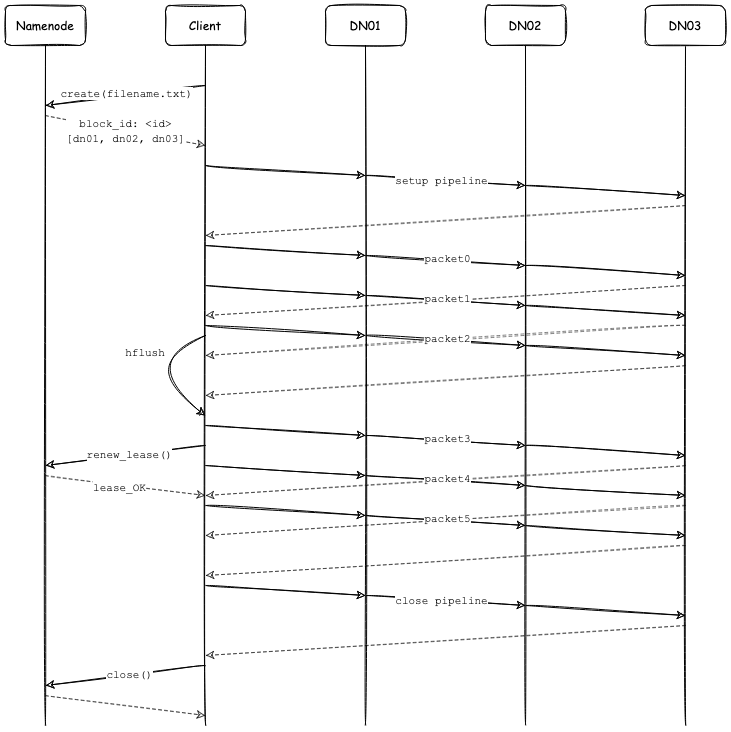
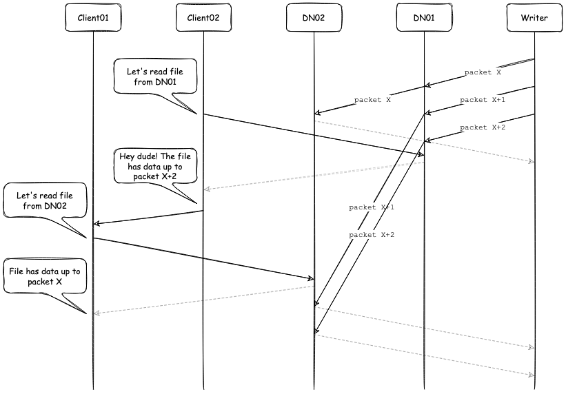

# HDFS

HDFS is a distributed file system, spanning over multiple machines. It emphasizes on high throughput of data access rather than low latency of data access.

>HDFS favors processing data in bulk at a high rate, in expense of stringent response time requirements for an individual read or write.

HDFS applications specify a write-once-read-many access model for files. In HDFS most files are mutated by appending new data rather than overwriting existing data. **Random writes within a file are practically non-existent**. Once written, the files are only read, and often only sequentially. This assumption simplifies data coherency issues and enables high throughput data access.

> Files in HDFS are write-once and have strictly one writer at any time.

## Block size
Disks have a block size, which is the minimum amount of data that they can read or write. Filesystems are abstractions build on top of regular disks dealing with data in blocks, which are an integral multiple of the disk block size. Filesystem blocks are typically a few kilobytes in size, whereas disk blocks are normally 512 bytes.

Seeking is the action of moving the file pointer to a specific offset within a file. So, if you want to seek to offset P of a file with a block size B, you simply need to lookup the block the requested offset falls within, read it off of disk, and position a pointer to the appropriate location within that block.

```math
blockIndex = floor(P / B)
```

As any other filesystem, HDFS stores each file as a sequence of blocks; all blocks in a file except the last block are of the same size. In HDFS, however, there is an additional layer of indirection, namely the namenode. An HDFS block resides on an OS filesystem (e.g. ext4) so an HDFS seek first locates the HDFS block using namenode information, and then must locate the OS filesystem block on one of the datanodes where there is an available replica. However, it's more complex than that. HDFS datanodes perform IO in buffered chunks and so when you want a specific position within an HDFS block, more (OS) blocks may be read off of the disk than actually needed.

## Namenodes vs datanodes
An HDFS cluster follows a master/slave architecture: a single namenode (the master) and a number of datanodes (workers). The namenode manages the file system namespace and regulates access to files by clients. Datanodes, usually one per node, manage storage attached to the nodes that they run on. The namenode executes file system namespace operations like opening, closing, and renaming files and directories. It also determines the mapping of blocks to datanodes. The datanodes are responsible for serving read and write requests from the clients of the filesystem. The datanodes also perform block creation, deletion, and replication upon instruction from the namenode.

The namenode uses a transaction log called the **edit log** to persistently record every change that occurs to file system metadata (e.g. creating, moving or deleting the file). The namenode uses a file in its local host OS file system to store the edit log. The use of an edit log is similar to a write-ahead log in tranditional databases. The namenode also has an in-memory representation of the filesystem metadata, <ins>which it updates **after** the edit log has been modified</ins>. The in-memory metadata is used to serve read request. Conceptually the edit log is a single entity, but it is represented as a number of files on disk (rotating log files). It is crucial for the edit log to be flushed and synced after every transaction before a success code is returned to the client. For namenodes that write to multiple directories (e.g. local and NFS), the write must be flushed and synced to every copy before returning successfully. This ensures that no transaction is lost due to machine failure.

The entire file system namespace, including the mapping of blocks to files and file system properties, is stored in a file called namespace image or **FsImage**. The FsImage is stored as a file in the namenode's file system too. The FsImage is a snapshot of the namespace metadata. However, it is not updated for every filesystem write operation, because writing out the FsImage file, which can grow to be gigabytes in size, would be very slow.

**Chekpointing** is the process of applying editlog's transactions to the in-memory representation of the FsImage, and flushing out this new version to disk<sup>[1](#secondary)</sup>. Before checkpointing, the namenode switches to a new editlog file and (in the background) applies all changes in the previous editlog files to the FsImage. Once checkpointing has finished the namenode trancates the editlog.

The namenode does not keep a persistent record of which datanodes have a replica of a given block. The namenode gets this information at startup, when the datanodes register themselves with the namenode. The namenode can keep itself up-to-date thereafter because it controls all block placement and monitors datanodes status with regular hearbeat messages. A datanode has the final word over what blocks it does or does not have on its own disks. There is no point in trying to maintain a consistent view of this information on the namenode because errors on a datanodes may cause blocks to vanish spontaneously.

The datanodes have no knowledge about HDFS files. They store each block of HDFS data in a separate file in their local file system. Along with the actual data, datanodes store a file containing metadata for each block, including checksums and the block's generation timestamp.

<sup><a name="secondary">1</a></sup> In large clusters, checkpointing is performed by the secondary namenode. Checkpointing could be a resource-intensive process, and we do not want to affect the operations on the primary.

## Communication
All HDFS communication protocols are layered on top of the TCP/IP protocol using RPC. By design, the namenode never initiates any RPC calls. Instead, it only responds to RPC requests issued by datanodes or clients. During normal operation datanodes send **heartbeats** to the namenode to confirm that the datanode is operating and the block replicas it hosts are available. If a datanode fails to contact the namenode (e.g. due to a network partitioning), the namenode declares the datanode to be out of service and the block replicas
hosted by that datanode to be unavailable. Additional information such as datanode's total storage capacity, fraction of storage in use, and the number of data transfers currently in progress is piggybacked in the hearbeat message. These statistics are used for the namenode's space allocation and load balancing decisions. The namenode uses replies to heartbeats to send instructions/commands to the datanodes.
* replicate blocks to other nodes
* remove local block replicas
* re-register or to shut down the node
* send an immediate block report

## Reading a file
When a client wants to read a file it first contacts the namenode using RPCs to determine the locations of the blocks of the file. For each block, the namenode returns the datanodes that have a copy of that block, sorted according to their proximity to the client. While reading data, the client verifies file checksums for each block. The checksums are stored as hidden files in the same directory with the blocks. If a datanode is unreachable for reads, the clients fallbacks to the next datanode in line.

The most important aspect of this design is that clients contact datanodes directly to retrieve data. The namenode guides the clients as to the best datanode for each block. This way the data traffic is spread across the datanodes, while the namenode just servers block location requests from memory.

## Storing a file
When a client wants to write data to a file, first creates the file by making an RPC call to the namenode. The namenode performs various checks to make sure the file doesn’t already exist and that the client has the right permissions to create the file. If these checks pass, the namenode makes a record of the new file and returns back a unique identity of the first block of the file (e.g. logical increment, also known as generation timestamp) along with the datanodes that will be used to store that first block. The bytes that an application writes, first buffer at the client side into an internal queue. After a packet buffer is filled (typically 64 KB), the data are pushed to HDFS. Under the hood a **pipeline** is formed. The client sends the packet to the first datanode in the pipeline, which stores the data and forwards the packet to the second datanode in the pipeline. Similarly, the second datanode stores the packet and forwards it to the third datanode and so on. Once the last datanode in the pipeline is reached, acknowledgements travel all the way back to the client. Bytes are pushed to the pipeline as a sequence of packets. The next packet can be pushed to the pipeline before receiving the acknowledgements for the previous packets. In this sense blocks (and files) are pushed to HDFS as a stream of packets. When a block is filled, the client requests from namenode the unique identity of the next block along with the new datanodes that will host replicas of that block.

<p align="center"><a name="write">
  
</a></p>
<p align = "center">
Figure 1: A client writing data to HDFS
</p>

What happens if a datanode fails while data is written to it ? The first step is to remove the failed datanode from the pipeline. The block that was being written gets a new identity, which is communicated to the namenode, so that the partial block on the failed datanode will be deleted if the failed datanode ever recovers (it will be a block that does not belong to any known file). The remainder of the block’s data is written to the good datanodes in the pipeline using the new block identity. Eventually, the namenode notices that the block is under-replicated, and it arranges for a further replica to be created on another node.

After data are written to an HDFS file, HDFS does not provide any guarantee that data are visible to new readers until the file is closed. If a client needs the visibility guarantee, it can explicitly call the `hflush()` operation. After a successful return from `hflush()`, HDFS guarantees that the data written up to that point in the file has reached all the datanodes in the write pipeline and is visible to all new readers. Note that `hflush()` does not guarantee that the datanodes have written the data to disk, only that it’s in the datanodes’ memory. Writers can use `hsync()` to force datanodes to store data to disk<sup>[2](#hsync)</sup>. After the file is closed, the bytes written cannot be altered or removed except that new data can be added to the file by reopening the file for append.

HDFS implements a single-writer, multiple-reader model. The HDFS client that opens a file for writing is granted a lease for the file; no other client can write to the file. The writer periodically renews the lease by sending a heartbeat to the namenode. When the file is closed, the lease is revoked. The writer's lease does not prevent other clients from reading the file; a file may have many concurrent readers.

<sup><a name="hsync">2</a></sup> `hsync()` is a very costly IO operation

## Resiliency
Without the namenode, the filesystem cannot be used. In fact, if the machine running the namenode were obliterated, all the files on the filesystem would be lost since there would be no way of knowing how to reconstruct the files from the blocks on the datanodes. That's the point where the editlog and FsImage come into play. If the namenode fails, then the latest state of its metadata can be reconstructed by loading the latest FsImage from disk into memory, and then applying each of the transactions from the relevant point onward in the edit log.

However the process of merging the editlog with the FsImage can be slow, especially when editlog grows in size. This can severly impact the namenode startup time, since it would take a long time to apply each of the transactions in its (very long) editlog. During this time, the filesystem would be offline. Checkpointing helps reducing startup times, by periodically applying the editlog to the FsImage, in order to create a new FsImage.

It is also possible to run a **secondary namenode**, whose main role is to periodically merge the FsImage with the editlog to prevent the editlog from becoming too large. The secondary namenode usually runs on a separate physical machine because it requires plenty of CPU and as much memory as the namenode to perform the merge. This is by design, since in the event of total namenode failure (when there are no recoverable backups), it allows recovery from the secondary namenode. However, the state of the secondary namenode lags that of the primary, so in the event of total failure of the primary, data loss is almost certain.

While using a secondary namenode helps reduce the startup times, it does not provide high availability of the filesystem. The namenode is still a *single point of failure*. A recovered namenode is not able to serve requests until it has (i) loaded its namespace image into memory, (ii) replayed its edit log, and (iii) received enough block reports from the datanodes to leave safe mode. On large clusters with many files and blocks, the time it takes for a namenode to start from cold can be 30 minutes or more. The long recovery time is a problem for routine maintenance, too. In fact, because unexpected failure of the namenode is so rare, the case for planned downtime is actually more important in practice.

HDFS **high availibility (HA)** uses a pair of namenodes in an active-standby configuration. In the event of the failure of the active namenode, the standby takes over its duties to continue servicing client requests. The standy namenode needs to maintain enough state to provide a fast failover. Two architectural changes are needed to allow for high availability:
* The namenodes must use highly available shared storage to share the editlog (e.g. NFS).
* Datanodes must send block reports to both namenodes.

When the active namenode performs any namespace modification, it durably logs the modification record to a shared storage. The standby node continuously watches the shared storage for changes to the edit log. Once the standby observes the edits, it applies these edits to its own namespace. The process is called *journal tailing*.

It's vital for the correct operation of an HA cluster to fence against a split-brain situation, where both namenodes believe they are active. The transition from the active namenode to the standby is managed by the *failover controller*, which under the hood uses **Zookeeper** to ensure that only one namenode is active at any given time. When using Zookeeper, the active namenode holds a special "lock" ephemeral znode. If the session expires, the lock node will be automatically deleted. Once the "lock" znode is removed, all standby namenodes get a notification (they watch the "lock" znode) and they attempt to recreate the ephemeral "lock" znode. The namenode that manages to create the znode takes over by transitioning to active state. More fencing mechanisms have be developed; the range of fencing mechanisms includes revoking a namenode’s access to the shared storage directory (by using vendor specific NFS commands) or even "shooting the other node in the head" (power down the host machine).

## Consistency model
The HDFS consistency model enjoys the benefits of immutability. Additionally, for every file there is at most one writer at a time. In the case that there are no existing writers to a file, new readers can access all the file contents, without any consistency issue.

In the case of reading a file that is concurrently being written, things can get messy. After creating a file, all of its blocks are visible in the filesystem namespace. However, the bytes written to the file are not guaranteed to reach all datanodes in the same pace; some datanodes might have a more up-to-date view of the file contents. Without the use of `hflush` and `hsync`, HDFS cannot guarantee read consistency under concurrent writes.

<p align="center"><a name="write">
  
</a></p>
<p align = "center">
Figure 1: An example of a read inconsistency
</p>